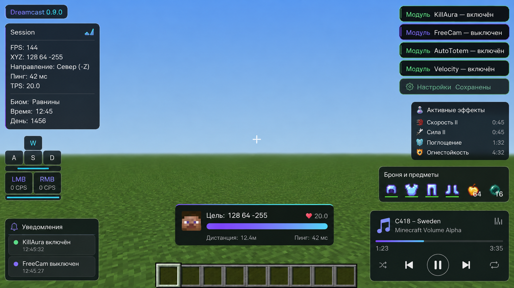

<div align="center">

# Dreamcast DLC 2.0

**Утилити-клиент для Minecraft 26.2: всё лучшее из Meteor Client и LiquidBounce — в одном моде.**

[](https://www.minecraft.net/)
[](https://adoptium.net/)
[](https://github.com/inkvizrebirth/Dreamcast/releases)
[](https://github.com/inkvizrebirth/Dreamcast/actions/workflows/build.yml)

</div>



## Что это

Dreamcast 2.0 — полная переработка клиента: архитектура и набор функций по образцу
Meteor Client и LiquidBounce. 55+ модулей в семи категориях, команды в чате,
список друзей, именованные профили настроек, перетаскиваемый HUD и собственный
интерфейс игры — и всё это по-прежнему собирается одним jar со встроенными
производительными модами.

## Модули

### ⚔ Бой
| Модуль | Что делает |
|---|---|
| **KillAura** | Автоатака: режимы «Быстрый/Легитный», sticky-цель, RayTrace-проверка, авто-блок щитом, смарт-криты, w-tap, коррекция движений, лимиты (еда, тотем, вода, прыжок) |
| **Criticals** | Крит ×1.5 каждым ударом: пакетный мини-прыжок (NCP), мини-хоп или реальный прыжок |
| **Velocity** | Анти-нокбэк: проценты по осям или полное гашение ударов и взрывов |
| **TriggerBot** | Бьёт цель под прицелом с задержкой |
| **AutoClicker** | Автоклик с плавающим CPS (ЛКМ/ПКМ/обе) |
| **BowAimbot** | Наведение лука с честной баллистикой (гравитация + драг) |
| **AutoTotem** | Тотем во вторую руку быстрее сервера |
| **HitSounds / HitParticles** | Звук и ударные волны попаданий |

### 🏃 Движение
**Flight** (полёт с ускорением), **Speed** (strafe/bunny-hop разгон), **Sprint**,
**Jesus** (ходьба по воде и лаве), **LongJump**, **Step** (автоподъём без прыжка),
**Blink** (задержка исходящих пакетов), **Sneak** (в т.ч. пакетный — без потери скорости),
**AutoJump**, **ElytraBoost** (авто-ракеты), **Spider**, **NoSlow** (+NoWeb),
**NoFallDamage** (ватердроп-ведро), **AutoWalk**, **FreeCam**, **FreeLook**.

### 🧍 Игрок
**AutoArmor** (лучшая броня кликами как человек), **AutoEat** (+золотые яблоки по HP),
**AutoBuff** (зелья: питьё и splash), **AutoTool**, **AutoFish** (подсечка и перезакидывание),
**ChestStealer**, **AutoRespawn**, **AntiAFK**, **NoRotate** (анти-доорот сервером),
**AutoMine** (с Baritone и «человечными» доворотами).

### 🌍 Мир
**Scaffold** (Normal/Legit/Telly, silent-ротация пакетами), **Nuker** (радиус + фильтр
по списку блоков), **AutoMine**.

### 🎨 Рендер
**ESP** (glow/бокс/цель, градиенты, радуга), **Tracers** (лучи, друзья зелёным),
**HoleESP** (безопасные дырки 1×1), **BlockESP**, **Breadcrumbs** (нить пути),
**Nametags** (HP, пинг, броня, эффекты, метка друга), **Trails**, **FullBright**,
**Zoom** (плавный, на удержании), **NoFOV**, **NoBlind** (тошнота/огонь/тьма),
**CameraTweaks** (без тряски урона и покачивания), **ViewModel**, **Обводка рук**,
**JumpEffect**, **HitParticles**.

### ⚙ Прочее и HUD
**ClickGUI** (стекло, темы, поиск), **HUD** (водяной знак, FPS/координаты/пинг,
список модулей, Target HUD, броня, эффекты, keystrokes+CPS, сессия с убийствами,
бинды, медиаплеер, уведомления — всё перетаскивается), **Macros**, **MediaPlayer**,
**Friends** + **MiddleClickFriend** (средний клик по игроку — в друзья),
свои главное меню, пауза, настройки, миры, серверы, альты и экран реконнекта.

## Команды чата

Префикс — `.` (сообщение на сервер не уходит):

| Команда | Пример |
|---|---|
| `.help [команда]` | `.help bind` |
| `.toggle <модуль> [on\|off]` | `.toggle sprint`, `.toggle flight on` |
| `.bind <модуль> <клавиша>` | `.bind zoom c`, `.bind killaura none` |
| `.friend add\|remove\|list\|clear [ник]` | `.friend add Notch` |
| `.config save\|load\|list\|delete <имя>` | `.config save pvp` |
| `.modules [категория]` | `.modules combat` |
| `.search <текст>` | `.search esp` |
| `.panic` | выключить всё разом |

## Установка

1. Установи Fabric Loader для **Minecraft 26.2** и Fabric API `0.159+`.
2. Скачай `dreamcast-2.0.0.jar` из [Releases](https://github.com/inkvizrebirth/Dreamcast/releases) и положи в `.minecraft/mods`.
3. Запусти игру на Java 25. Меню модулей — правый Shift.

## Управление (дефолты)

| Клавиша | Действие |
|---|---|
| `RShift` | ClickGUI |
| `H` | редактор HUD |
| `X` | KillAura |
| `N` | FreeCam |
| `K` | FreeLook |
| `B` | AutoMine |
| `G` | AutoWalk |
| `R` | AutoTotem |

Остальные бинды назначаются в ClickGUI или командой `.bind`.

## Сборка

```bash
JAVA_HOME=/path/to/jdk-25 ./gradlew build
```

Чистая логика модулей (баллистика, броня, еда, velocity, сканер дырок, парсер
команд) покрыта юнит-тестами — `./gradlew test`. CI собирает релиз с embedded-модами.

> Дисклеймер: клиент предназначен для одиночной игры, своих серверов и песочниц.
> На сторонних серверах использование чит-модулей может нарушать их правила.

Лицензия — [CC0](LICENSE).
